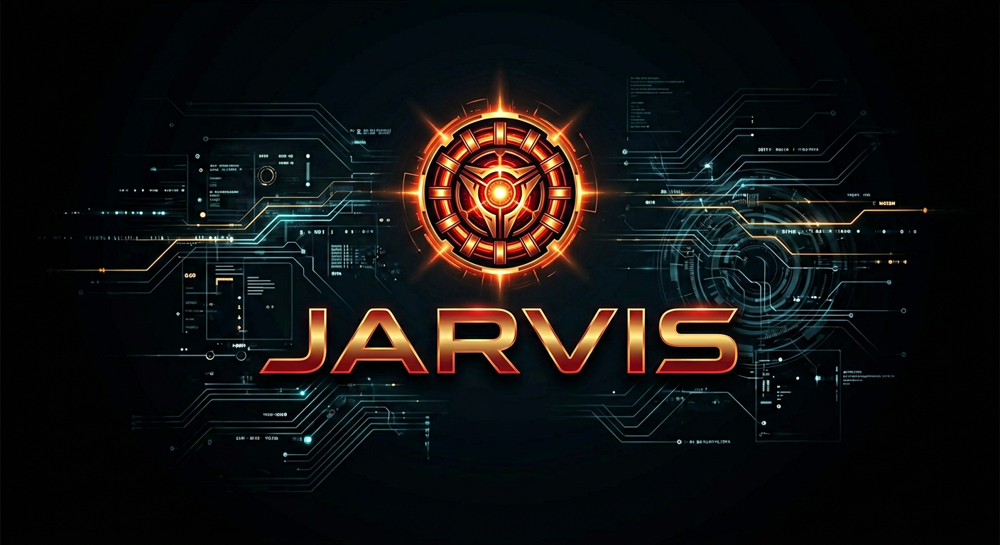

# JARVIS OS

<p align="center">
  
</p>

<p align="center">
  <strong>J.A.R.V.I.S. — Just A Rather Very Intelligent System</strong><br/>
  Professional, offline-first AI Desktop Operating Assistant
</p>

---

Inspired by the Iron Man cinematic interface — JARVIS OS brings a sophisticated, voice-controlled, multimodal AI companion directly to your desktop **and mobile device**.

**Version:** 2.0.0
**Status:** Production foundation (skills + voice + console + desktop automation + smart home + vision + mobile)
**License:** MIT (see LICENSE)
**Offline-first:** Local by default (Ollama + formant/Piper TTS + SQLite)
**Platforms:** Windows · macOS · Linux · Android · iOS (PWA)

---

## 🚀 Vision

A production-quality, secure, extensible desktop AI operating system that:
- Runs completely offline
- Understands natural language + voice + vision
- Automates complex workflows safely
- Controls your desktop, apps, and smart home
- Learns and adapts over time
- Provides a beautiful, cinematic UI
- Is fully modular and plugin-driven
- Works on desktop and mobile

## ✨ Key Features

- **Core AI Engine**: Local LLM (Ollama) with tool-calling and long-term memory
- **Voice Interface**: Offline formant TTS with **2 cinematic voices — JARVIS (male) & FRIDAY (female)**, optional Whisper STT / browser mic
- **Wake Word**: Continuous "Hey JARVIS" detection (openWakeWord/Vosk)
- **One-command skills**: YouTube, Gmail, ChatGPT research, email drafts, timers, notes, maps…
- **Full Desktop GUI Automation**: Click any button, type text, manage windows, scroll, drag — full mouse/keyboard control
- **Smart Home / IoT**: Control lights, switches, scenes via HTTP/MQTT/Home Assistant
- **Camera & Vision**: Face detection, screen OCR, QR scanning, environment analysis
- **Calendar & Scheduling**: Natural language event creation, reminders, conflict detection
- **Mission planner**: Multi-step commands (`open youtube and set a timer…`)
- **Iron Man personality**: Calm butler tone, always addresses you as "sir"
- **Electron Desktop Shell**: System tray, global hotkey (Ctrl+J), overlay HUD
- **Boot with OS**: Auto-start JARVIS on system boot (Windows/macOS/Linux)
- **Mobile Access**: PWA for Android/iOS — add to home screen, full voice console
- **Security**: Sandboxed execution, permission system, audit logs
- **Developer Friendly**: Clean APIs, full test coverage, quality gate 10/10

---

## 🎙️ Voice Profiles

JARVIS OS features **2 premium cinematic voices** inspired by the Iron Man films:

| ID | Gender | Style | Inspiration |
|----|--------|-------|-------------|
| `jarvis` | Male | Deep measured British butler | JARVIS (Iron Man) |
| `friday` | Female | Cool measured AI companion | FRIDAY (Iron Man) |

**Voice characteristics:**
- **Smooth & natural** — No robotic cracking or harshness
- **Warm tone** — Breathable, human-like quality
- **British butler persona** — Calm, precise, always addresses you as "sir"
- **Offline-first** — No cloud dependency, works completely locally

In the console: pick a voice → **Preview voice** → send commands.

API: `GET /api/v1/voice/voices` · `POST /api/v1/voice/speak` with `"voice": "friday"`

Default: set `JARVIS_UI_DEFAULT_VOICE=jarvis` (or `friday`) in `.env`.

---

## 🏗️ Architecture Overview

```
JARVIS-AI/
├── agents/           # Orchestrator + mission planner + personality
├── automation/       # Desktop GUI + smart home + OS integration
│   ├── desktop.py    # Full GUI automation (click, type, windows)
│   ├── smart_home.py # IoT control (lights, switches, scenes)
│   └── os_integration.py # Calendar, startup, notifications
├── backend/          # FastAPI (ai, voice, skills, memory, system)
├── core/             # Config + security (permissions, sandbox, audit)
├── skills/           # ★ Powers: browser, apps, email, ChatGPT, desktop, smart home, calendar, vision...
├── voice/            # Multi-voice TTS + wake word + STT
├── vision/           # OCR, screen understanding, camera, face detection
├── electron/         # Desktop shell (tray, hotkey, overlay HUD)
├── frontend/public/  # Voice console + Iron Man HUD → /console · /console_hud
├── docs/             # architecture · ROADMAP · QUALITY · IRON_MAN_OS · assets
├── tests/ · scripts/
└── mobile/           # PWA config for Android/iOS
```

**One-command examples (working now):**
- `Open YouTube` / `Open YouTube search lo-fi`
- `Open Gmail` · `open whatsapp`
- `ask chatgpt about machine learning`
- `help me write a cover letter`
- `email demo@example.com saying Hello from JARVIS`
- `open youtube and set a timer for 5 minutes` (multi-step mission)
- `System status` · `What time is it?`
- `click the OK button` · `type hello world` · `press enter`
- `switch to chrome` · `close this window` · `scroll down`
- `turn on the living room light` · `activate movie scene`
- `schedule meeting tomorrow at 3pm` · `remind me to call mom in 10 minutes`
- `take a photo` · `detect faces` · `what's on my screen`
- `take a screenshot` · `find the submit button`

**Setup guides:** [`docs/guides/email_and_voice.md`](docs/guides/email_and_voice.md) · [`.env.example`](.env.example)
**Roadmap:** [`docs/ROADMAP.md`](docs/ROADMAP.md) · **Architecture:** [`docs/architecture.md`](docs/architecture.md)
**Quality:** [`docs/QUALITY.md`](docs/QUALITY.md) · **Iron Man scope:** [`docs/IRON_MAN_OS.md`](docs/IRON_MAN_OS.md)

---

## 📦 Tech Stack

| Layer          | Technology                          |
|----------------|-------------------------------------|
| Backend        | Python 3.11, FastAPI, Uvicorn, Pydantic, SQLAlchemy |
| AI / LLM       | Ollama (local) |
| Voice          | jarvis-formant (multi-voice), optional piper-tts, faster-whisper, openWakeWord |
| Vision         | Tesseract OCR, OpenCV, face_recognition |
| Memory         | SQLite, contacts JSON |
| Frontend       | Voice console (HTML/CSS/JS), React planned |
| Desktop Shell  | Electron (tray, global hotkey, overlay HUD) |
| Mobile         | PWA (Progressive Web App) |
| Testing        | pytest, quality_gate.py |
| Security       | pydantic-settings, cryptography, sandboxing |

---

## 🛠️ Quick Start (Development)

### Prerequisites
- Python >= 3.11
- Git
- (Optional) Ollama + `llama3.2` for deeper chat
- (Optional) Node.js for Electron desktop shell

### 1. Clone & Setup

```bash
git clone https://github.com/ARENJKY369/JARVIS-AI.git
cd JARVIS-AI

python -m venv .venv
source .venv/bin/activate   # Windows: .venv\Scripts\activate
pip install -r requirements.txt
```

### 2. Start JARVIS

```bash
export PYTHONPATH=.
# Option A
python scripts/start_jarvis.sh

# Option B
uvicorn backend.app.main:app --host 127.0.0.1 --port 8000
```

Open the **Voice Console**:

**http://127.0.0.1:8000/console**  — Main console (chat, TTS, skills)

**http://127.0.0.1:8000/console_hud**  — Iron Man HUD (arc reactor, targeting, diagnostics)

1. Choose a **Male** or **Female** voice
2. Click **Preview voice**
3. Click **▶ Hear JARVIS** or type a command

### 3. Run Full Validation

```bash
python scripts/quality_gate.py   # must be 10/10 all dimensions
python scripts/validate.py
pytest tests/unit/ -o addopts= -q
```

### 4. Electron Desktop Shell (Optional)

```bash
cd electron
npm install
npm start
```

Features:
- **Ctrl+J** — Toggle JARVIS window
- **Ctrl+Shift+J** — Toggle overlay HUD
- **Ctrl+Alt+J** — Quick voice command
- System tray with quick actions
- Boot with OS option in tray menu

---

## 📱 Mobile Access (Android / iOS)

JARVIS OS works on your phone via **Progressive Web App**:

1. Connect your phone to the same WiFi network as your PC
2. Open `http://<your-pc-ip>:8000/console` in Chrome (Android) or Safari (iOS)
3. Tap **"Add to Home Screen"** — installs like a native app
4. Full voice console, skills, and HUD work on mobile

**Note:** Replace `<your-pc-ip>` with your computer's local IP address (e.g., `192.168.1.100`).

For native mobile apps, the architecture supports React Native or Capacitor builds.

---

## 🖥️ Desktop GUI Automation

Full control of your desktop environment:

| Action | Command Example |
|--------|----------------|
| Click element | `click the OK button` |
| Click coordinates | `click 500, 300` |
| Type text | `type hello world` |
| Press key | `press enter` |
| Hotkey | `press alt tab` |
| Scroll | `scroll down` · `scroll up 5` |
| Window management | `switch to chrome` · `close this window` · `minimize firefox` |
| Screenshot | `take a screenshot` |
| Find element | `find the submit button` |

---

## 🏠 Smart Home / IoT

Control your smart home devices:

| Action | Command Example |
|--------|----------------|
| Light on/off | `turn on the living room light` |
| Brightness | `set kitchen light to 50%` |
| Scenes | `activate movie scene` |
| Switches | `turn on the fan` |
| Status | `smart home status` |

**Supported protocols:**
- HTTP/REST (Philips Hue, Tasmota, ESPHome)
- MQTT (generic IoT devices)
- Home Assistant API

---

## 📅 Calendar & Scheduling

Natural language calendar management:

| Action | Command Example |
|--------|----------------|
| Add event | `schedule meeting tomorrow at 3pm` |
| View today | `what's on my calendar today` |
| View week | `show this week's schedule` |
| Reminders | `remind me to call mom in 10 minutes` |
| Cancel | `cancel my 3pm meeting` |

---

## 👁️ Vision & Camera

See and understand the world:

| Action | Command Example |
|--------|----------------|
| Take photo | `take a photo` |
| Face detection | `detect faces` |
| Screen reading | `what's on my screen` |
| QR scanning | `scan qr code` |
| Environment | `analyze the room` |

---

## 🎨 Branding & Assets

<p align="center">
  
  &nbsp;&nbsp;
  
</p>

| Asset | Path |
|-------|------|
| Primary logo | `docs/assets/jarvis_logo.png` |
| Dark HUD logo | `docs/assets/jarvis_logo_dark.png` |
| App icon | `docs/assets/jarvis_icon.png` |
| Welcome audio | `docs/assets/jarvis_welcome.wav` |

Colors: cyan `#00E5FF` · gold `#C9A227` · void `#05080F`

---

## 🖥️ Console URLs

| Interface | URL | Description |
|-----------|-----|-------------|
| **Voice Console** | `http://127.0.0.1:8000/console` | Main voice + skills console (chat, TTS, skills) |
| **Iron Man HUD** | `http://127.0.0.1:8000/console_hud` | Full-screen HUD: arc reactor, mission log, targeting, diagnostics, voice commands |

Both served by the FastAPI backend. Open in browser after starting the server.

---

## 📖 User Manual

### Getting Started (First Time Setup)

1. **Start the server** (see Quick Start above)
2. Open `http://127.0.0.1:8000/console` in your browser
3. **Select a voice** from the dropdown (Male or Female)
4. Click **"Preview voice"** to hear the selected voice
5. Click **"▶ Hear JARVIS"** for a demo
6. **Type a command** and press Enter, or click the microphone to speak

### Voice Console (Main Interface)

The Voice Console is your primary interface for interacting with JARVIS.

**How to use:**
- **Type commands** in the text box and press Enter
- **Click the microphone** 🎤 and speak your command (requires browser speech recognition)
- **Quick buttons** provide one-click access to common commands
- **Voice dropdown** lets you switch between JARVIS (male) and FRIDAY (female)

**Example commands to try:**
```
Hello JARVIS
System status
Open YouTube
Open Gmail
ask chatgpt about quantum computing
set a timer for 5 minutes
note buy milk
calculate 25 * 48
What can you do?
```

### Iron Man HUD Interface

The HUD provides a cinematic Iron Man-style interface with real-time diagnostics.

**How to access:**
- From Voice Console: Click the gold **"🎯 Iron Man HUD"** button
- Direct URL: `http://127.0.0.1:8000/console_hud`

**HUD Features:**
- **Arc Reactor** — Pulses when JARVIS is speaking
- **System Status** — Core, Voice, Network, Memory, CPU, Battery
- **Mission Log** — Real-time log of all commands and responses
- **Voice Waveform** — Visual indicator during speech
- **Diagnostics** — Core temp, power cells, neural link, latency
- **Command Bar** — Type or speak commands directly
- **Quick Commands** — One-click access to common tasks

**Navigation:**
- Click **"◀ CONSOLE"** (top-right) to return to Voice Console

### Voice Profiles

Choose between **2 premium cinematic voices**:

| Voice | Gender | Description | Inspiration |
|-------|--------|-------------|-------------|
| `jarvis` | Male | Deep measured British butler (default) | JARVIS (Iron Man) |
| `friday` | Female | Cool measured AI companion | FRIDAY (Iron Man) |

**Voice quality:**
- Smooth and natural — no robotic cracking
- Warm, breathable tone
- British butler persona — calm, precise, addresses you as "sir"

**To change voice:** Select from dropdown → Click "Preview voice" → Send command

### Desktop GUI Automation

Control your desktop with natural language:

| What to say | What happens |
|-------------|--------------|
| `click the OK button` | Clicks the OK button on screen |
| `type hello world` | Types text at cursor position |
| `press enter` | Presses Enter key |
| `press alt tab` | Sends Alt+Tab hotkey |
| `scroll down` | Scrolls the page down |
| `switch to chrome` | Brings Chrome to focus |
| `close this window` | Closes the active window |
| `take a screenshot` | Captures the screen |

### Smart Home Control

Control IoT devices with voice:

| What to say | What happens |
|-------------|--------------|
| `turn on the living room light` | Turns on the light |
| `set kitchen light to 50%` | Adjusts brightness |
| `activate movie scene` | Activates a scene |
| `turn on the fan` | Controls a switch |
| `smart home status` | Reports device status |

### Calendar & Reminders

Manage your schedule naturally:

| What to say | What happens |
|-------------|--------------|
| `schedule meeting tomorrow at 3pm` | Creates calendar event |
| `what's on my calendar today` | Shows today's events |
| `remind me to call mom in 10 minutes` | Sets a reminder |
| `cancel my 3pm meeting` | Removes an event |

### Vision & Camera

See and understand your environment:

| What to say | What happens |
|-------------|--------------|
| `take a photo` | Captures from camera |
| `detect faces` | Finds faces in frame |
| `what's on my screen` | Reads screen text (OCR) |
| `scan qr code` | Scans for QR codes |
| `analyze the room` | Environment analysis |

### Multi-Step Missions

Chain multiple actions in one command:

```
open youtube and set a timer for 5 minutes
search for iron man and take a screenshot
email mom saying happy birthday and open gmail
```

### Mobile Access (Android / iOS)

Use JARVIS on your phone:

1. **Connect** phone to same WiFi as your PC
2. **Open** `http://<your-pc-ip>:8000/console` in mobile browser
3. **Tap** "Add to Home Screen" (installs like native app)
4. **Use** full voice console and HUD on mobile

**Find your PC IP:**
- Windows: Run `ipconfig` in Command Prompt
- Mac/Linux: Run `ifconfig` in Terminal

### Electron Desktop Shell (Optional)

For a native desktop experience:

```bash
cd electron
npm install
npm start
```

**Keyboard shortcuts:**
| Shortcut | Action |
|----------|--------|
| `Ctrl+J` | Toggle JARVIS window |
| `Ctrl+Shift+J` | Toggle overlay HUD |
| `Ctrl+Alt+J` | Quick voice command |

**System tray:**
- Right-click tray icon for quick actions
- Enable "Start with OS" for auto-boot

### API Reference

For developers who want to integrate programmatically:

| Endpoint | Method | Description |
|----------|--------|-------------|
| `/api/v1/skills` | GET | List all available skills |
| `/api/v1/skills/execute` | POST | Execute a skill by name or text |
| `/api/v1/voice/speak` | POST | Synthesize speech |
| `/api/v1/voice/voices` | GET | List voice profiles |
| `/api/v1/voice/command` | POST | Send voice/text command |
| `/api/v1/health` | GET | System health status |

**Example API call:**
```bash
curl -X POST http://127.0.0.1:8000/api/v1/skills/execute \
  -H "Content-Type: application/json" \
  -d '{"text": "Open YouTube", "dry_run": true}'
```

### Troubleshooting

| Problem | Solution |
|---------|----------|
| "Page Not Found" on HUD | Restart server, hard refresh browser (Ctrl+Shift+R) |
| No voice output | Click "Preview voice" first to unlock audio |
| Microphone not working | Use Chrome/Edge, allow microphone permission |
| Backend won't start | Check Python 3.11+, run `pip install -r requirements.txt` |
| Voice sounds robotic | Switch voice (JARVIS ↔ FRIDAY) in the dropdown |
| Mobile can't connect | Ensure same WiFi, check firewall for port 8000 |

### Configuration

Edit `.env` file to customize:

```env
# Voice settings
JARVIS_UI_DEFAULT_VOICE=jarvis
JARVIS_VOICE_TTS_ENGINE=auto

# Email (optional)
JARVIS_EMAIL_SMTP_HOST=smtp.gmail.com
JARVIS_EMAIL_SMTP_PORT=587
JARVIS_EMAIL_USERNAME=your-email@gmail.com
JARVIS_EMAIL_PASSWORD=your-app-password

# AI (optional - for deeper chat)
JARVIS_AI_PROVIDER=ollama
JARVIS_AI_MODEL=llama3.2
```

---

## 🔒 Security & Privacy

- All AI runs locally by default.
- No telemetry.
- Sandboxed automation.
- Explicit user consent for privileged operations.
- Full audit logging.
- Permission-based access control.

---

## 📜 License

MIT License. See `LICENSE` file.

---

**JARVIS OS** — *"At your service, sir."*
